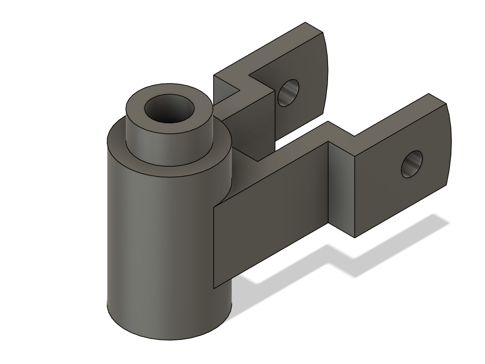
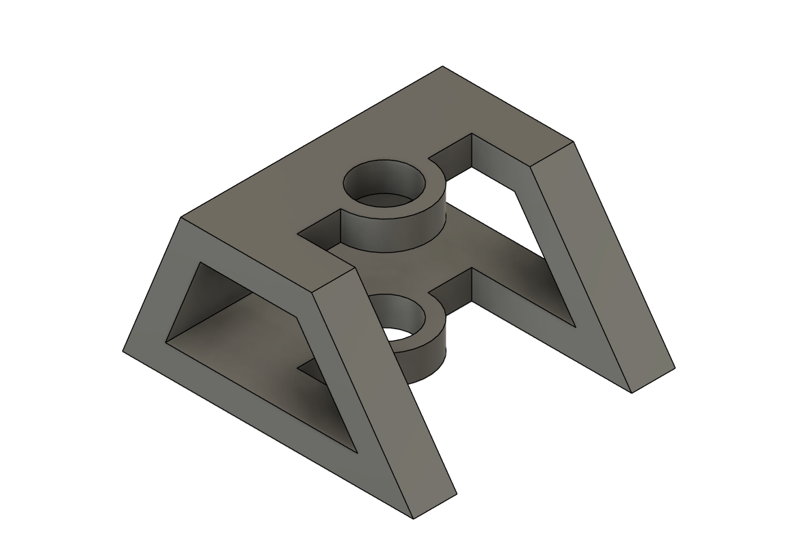
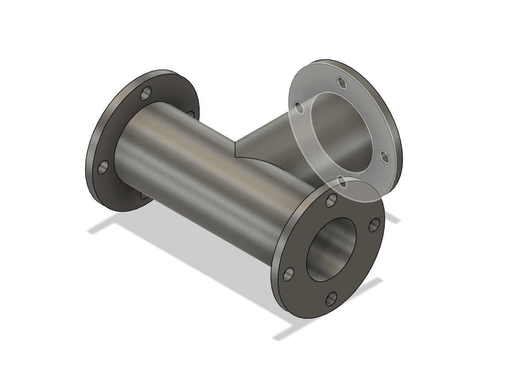

# Fusion Model Practice

This is a collection of models that have been made in Autodesk Fusion 360. These projects represent various exercises and practice assignments to develop 3D modeling skills and explore different design challenges.

## Featured Model Animation

## Modeling Process

The models in this collection were created using Autodesk Fusion 360's parametric modeling capabilities. Each project focuses on different aspects of 3D design:

- **Sketching fundamentals**: Creating precise 2D profiles as the foundation for 3D geometry
- **Feature-based modeling**: Using extrusions, revolves, sweeps, and lofts to build complex shapes
- **Assembly design**: Combining multiple components and understanding relationships between parts
- **Parametric constraints**: Applying dimensions and geometric constraints to maintain design intent
- **Design iteration**: Refining models through multiple versions to achieve optimal results

The workflow typically involves:
1. Analyzing the design requirements and sketching initial concepts
2. Creating detailed 2D sketches with proper constraints
3. Building 3D features step by step
4. Applying materials and appearances for visualization
5. Generating technical drawings and documentation

## Project Gallery

### Practice 1

### Practice 2

### Practice 3

